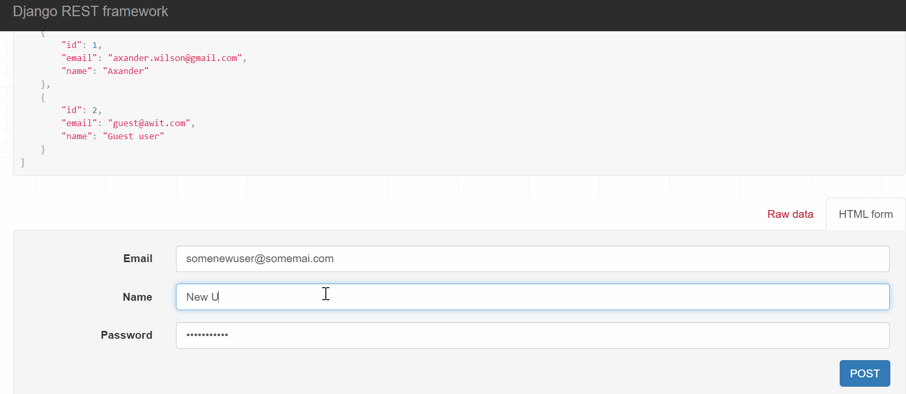
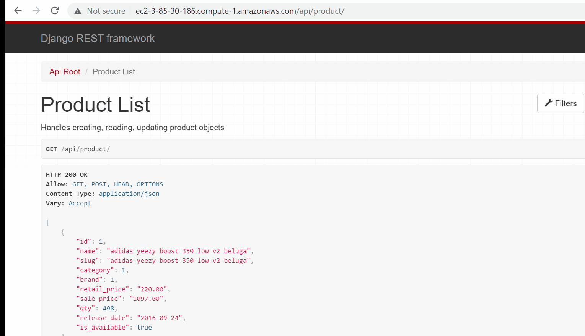

# Frontend E-commerce Website | Web Application 

#### Check out the live site:
<http://ec2-3-85-30-186.compute-1.amazonaws.com/api/>
## Background

The purpose of this project is to build a REST API that can be integrated with the fronend e-commerce webiste, the analytics dashboard, the prodcut recommendation engine, and future applications to be added to the Inventory Management eco-system.

## Overview

This REST API was built in Python's Django-Restful.

## Application Features

### Create a profile

In order to access the REST API, users have to signup for an account.

### Make GET, POST, PUT, PATCH, DELETE requests

### Search for Products

Checkout the handy search feature !

